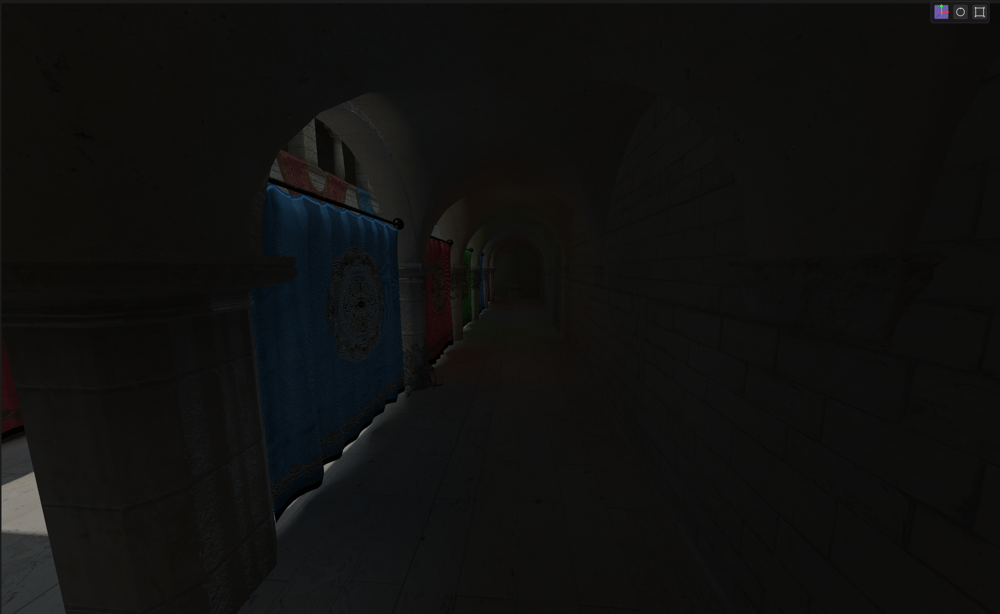
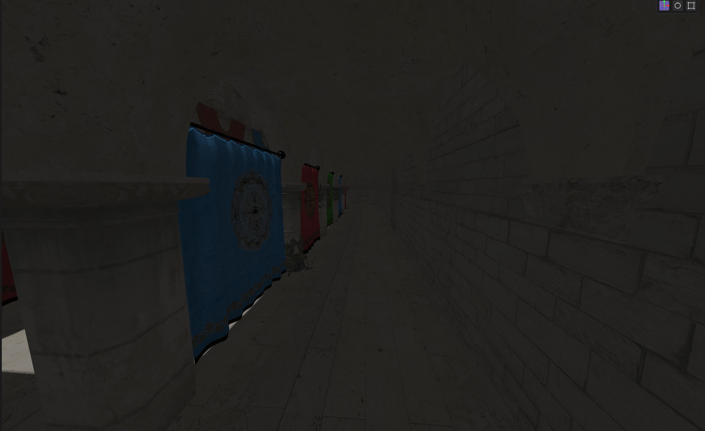
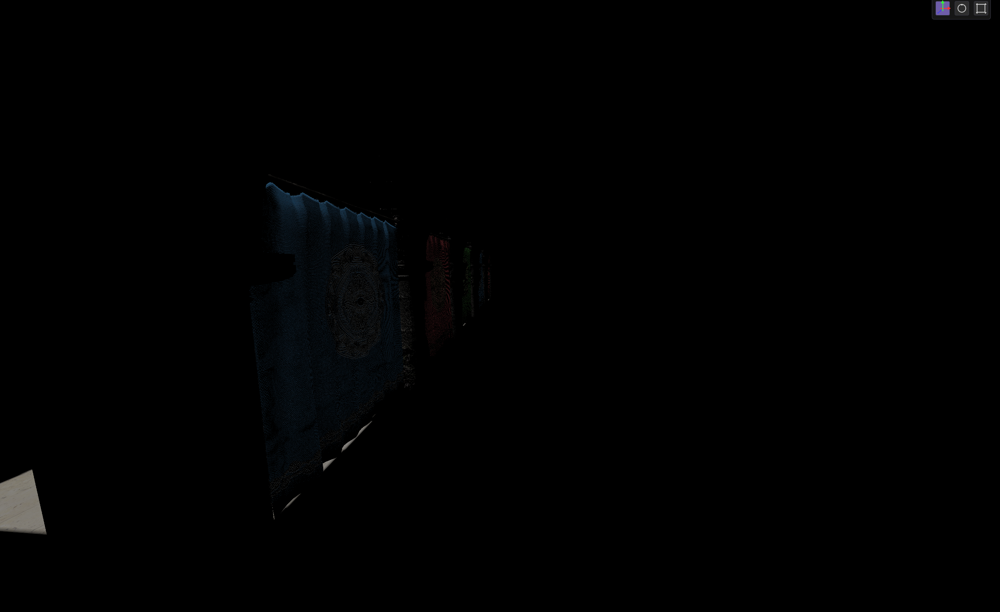
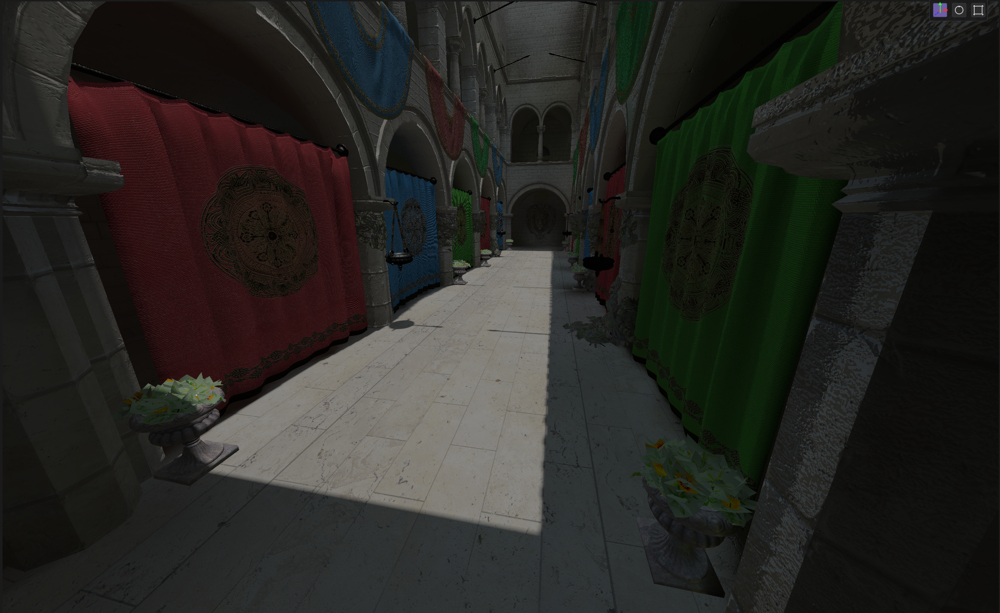
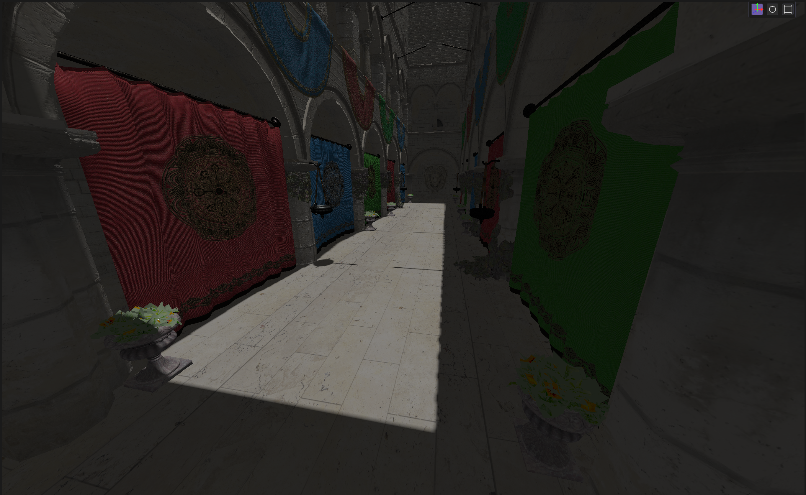
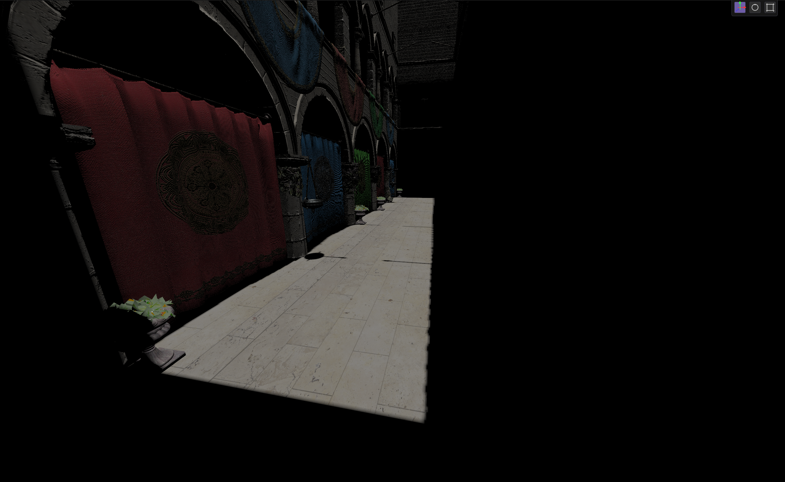

# Rapture Engine

A modern 3D game engine built with C++ and OpenGL. 
Created for learning 3D graphics and game engine architecures from scratch.


### Rendering
- Dynamic Diffuse Global Illumination
- PBR (Physically Based Rendering) with support for:
  - Metallic-roughness workflow
  - Specular-glossiness workflow
  - Full PBR texture maps
- Support for both forward and deferred rendering pipelines
- Support for Point, Spot and Directional lights
- Traditional and Cascaded Shadow Mapping (CSM)
- Frustum Culling
- Modular and Asynchronous command queue system for creating streamlined render passes

### Scene Management
- Scenes consist out of Entities using the [entt ECS](https://github.com/skypjack/entt)
- Advanced project hierarchy, Project->Worlds->Scenes

### Asset Pipeline
- Asset Manager for centralized loading of any asset
- Efficient and custom glTF 2.0 loader
- Multi-threaded Texture loading
- Material System
- Buffer pools for efficient Vertex and Index buffer allocation


## Showcase of recent features

### Dynamic Diffuse Global Illumination (DDGI)
An implementation of dynamic diffuse global illumination. Currently only uses a diffuse pipeline, with plans to include specular and glossy components later. The main sources used to develop this were the [NVIDIA DDGI paper](https://www.jcgt.org/published/0008/02/01/paper-lowres.pdf) and the [GDC](https://www.gdcvault.com/play/1026182/) talk for the main DDGI algorithm, and this [VkLBVH](https://github.com/MircoWerner/VkLBVH) repository for parallel LBVH and Radix sort implementations.

<table>
<tr>
<td><br>DDGI Diffuse</td>
<td><br>Direct + Ambient</td>
<td><br>Direct Only</td>
</tr>
</table>

<table>
<tr>
<td><br>DDGI Diffuse</td>
<td><br>Direct + Ambient</td>
<td><br>Direct Only</td>
</tr>
</table>

### Cascaded Shadow Mapping (CSM)

My implementation of CSM, it uses scene independent matrix transformations for the cascade ligthview matrices.
Uses a hybrid approach for spliting the frustum range with a lambda to bias either the logarithmic or linear splits


## Getting Started

### Requirements
- C++17/20 compiler
- CMake 3.15+
- OpenGL 4.6 Core Profile
- External libraries (see below)

### Dependencies
open-source libraries:
- GLFW for window management
- GLAD for OpenGL loading
- GLM for math
- ImGui for UI
- EnTT for ECS
- spdlog for logging
- stb_image for image loading
- YAML for serialization
- Tracy for frame profiling
- nlohmann/json (json for the glTF 2.0 loader)

### Building
```bash
# Build
mkdir build && cd build
cmake ..
cmake --build .
```
Or run the build script, then nagivate to the build folder: 
 - build\release\bin\Release
